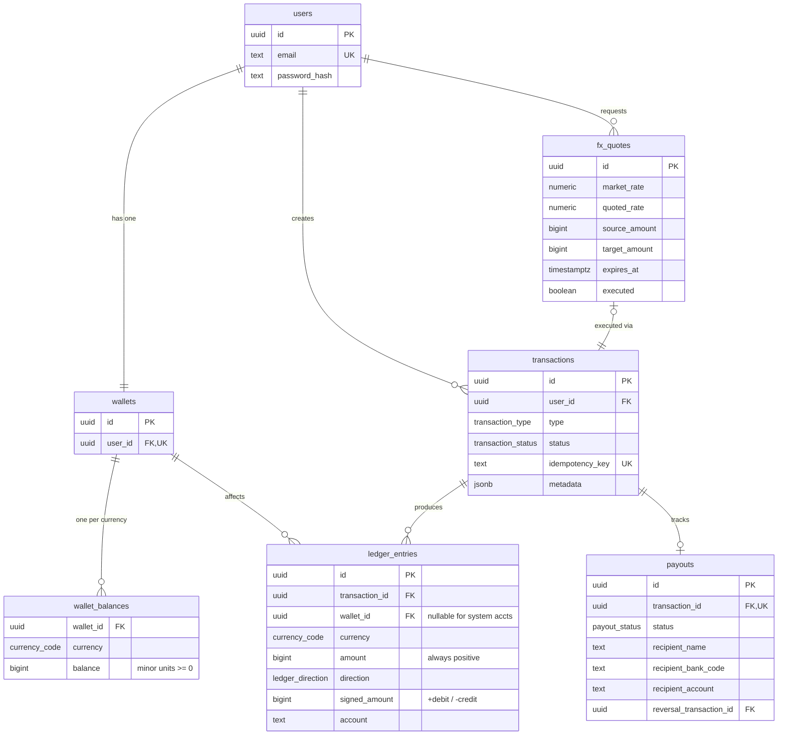

# Kite — Multi-Currency Wallet

A cross-border payments prototype with a double-entry ledger, FX conversion engine, and simulated payout rails.

**Stack:** React + TypeScript (Vite) · Go (chi) · PostgreSQL 16 · Redis · Docker

---

## Quick Start

```bash
git clone https://github.com/David-Kuku/kuku-kite-app.git
cd kuku-kite-app
docker compose up --build
```

- Frontend: `http://localhost:3000`
- API: `http://localhost:8080`

> `--build` is only needed on the first run or after code changes.

Seed a demo account:

```bash
cd grey-backend && make seed
# Login: demo@kite.test / password123
```

## Running Tests

Start the test database (schema is applied automatically on first start):

```bash
docker compose up postgres-test -d
```

Run the test suite:

```bash
cd grey-backend && make test
```

If you change the schema and need a clean database:

```bash
docker compose down postgres-test -v
docker compose up postgres-test -d
```

---

## Architecture

```
┌─────────────┐       ┌──────────────────────────────────────────────┐
│   React UI  │◄─────►│                Go API (chi)                  │
│  (Vite +    │  JSON  │                                              │
│  TanStack)  │       │  ┌──────────┐  ┌──────────┐  ┌───────────┐  │
└─────────────┘       │  │ Handlers │──│ Services  │──│   Repo    │  │
                      │  │ (HTTP)   │  │ (Business)│  │  (sqlx)   │  │
                      │  └──────────┘  └──────────┘  └─────┬─────┘  │
                      │                                     │        │
                      │  ┌──────────────────────────────────┘        │
                      │  ▼                                           │
                      │  ┌─────────────────────────────────────┐     │
                      │  │           PostgreSQL 16              │     │
                      │  │  users ── wallets ── wallet_balances │     │
                      │  │       transactions ── ledger_entries │     │
                      │  │  fx_quotes  payouts  fx_rate_cache  │     │
                      │  └─────────────────────────────────────┘     │
                      └──────────────────────────────────────────────┘
```

**Backend — three layers:**

- **Handlers** — HTTP concerns: parse, validate, call services, respond.
- **Services** — Business logic: Ledger (double-entry), FX (rates/quotes), Payout (state machine + BullMQ worker).
- **Repository** — Data access: all SQL in one place, `sqlx` with parameterised queries.

**Frontend — MVVM:**

- **Pages** — Pure JSX, no logic, just layout and rendering.
- **ViewModels** (`useXxxView` hooks) — All state, mutations, and derived data.
- **Services / Queries** — Axios calls wrapped in TanStack Query hooks.

### Why JWT

Stateless and horizontally scalable without Redis for sessions. In production: short-lived access tokens (15 min) + refresh tokens + revocation list in Redis.

---

## Data Model



### Key Design Decisions

**Money as `bigint` in minor units.** Cents for USD/EUR/GBP, kobo for NGN, cents for KES. No floating-point anywhere. `CHECK (balance >= 0)` on `wallet_balances` is a DB-level safety net; real enforcement is via the ledger service under a row lock.

**Double-entry ledger.** For every N operation, there are 2N writes `ledger_entries` whose `signed_amount` sums to zero per currency. `wallet_balances` is a read-optimised cache rebuildable from `SUM(signed_amount)`.

**FX conversions = two balanced legs.** USD→EUR creates 4 entries in 2 pairs: (1) user USD credit + house USD debit, (2) house EUR credit + user EUR debit. Each pair sums to zero within its currency.

**Concurrency via `SELECT FOR UPDATE`.** Lock the specific `wallet_balances` row before any mutation. Serialises concurrent operations per wallet+currency without table locks.

**Idempotency via unique constraint.** Deposits and payouts require a client `idempotency_key`. Unique constraint on `transactions.idempotency_key` prevents double-processing. Duplicates return the original transaction.

**Payout state machine.** Debited immediately on submission, then `pending → processing → successful|failed`. Failed payouts write inverse ledger entries — append-only, no mutation. Processed via a BullMQ worker (backed by Redis) with exponential backoff retries.

---

## API Endpoints

| Method | Path                          | Auth | Description           |
| ------ | ----------------------------- | ---- | --------------------- |
| POST   | `/api/v1/auth/signup`         | No   | Create account        |
| POST   | `/api/v1/auth/login`          | No   | Get JWT               |
| GET    | `/api/v1/wallet/balances`     | Yes  | All currency balances |
| POST   | `/api/v1/deposits`            | Yes  | Simulated deposit     |
| POST   | `/api/v1/conversions/quote`   | Yes  | Get FX quote          |
| POST   | `/api/v1/conversions/execute` | Yes  | Execute quote         |
| POST   | `/api/v1/payouts`             | Yes  | Initiate payout       |
| GET    | `/api/v1/transactions`        | Yes  | Paginated history     |
| GET    | `/api/v1/health`              | No   | Health check          |

### Error Format

```json
{
  "code": "INSUFFICIENT_BALANCE",
  "message": "Insufficient balance in NGN. Available: NGN 500.00",
  "details": { "amount": "must be positive" }
}
```

Codes: `VALIDATION_ERROR`, `INVALID_CREDENTIALS`, `EMAIL_EXISTS`, `INSUFFICIENT_BALANCE`, `QUOTE_EXPIRED`, `QUOTE_ALREADY_EXECUTED`, `QUOTE_NOT_FOUND`, `AUTH_REQUIRED`, `INVALID_TOKEN`, `INTERNAL_ERROR`.

---

## Trade-offs

**Payout worker shares a process with the API.** The spec offered three ways to simulate async payout state transitions: a delay, a manual admin endpoint, or a background job. I chose the background job because Redis was already in the stack for FX rate caching, the queue runs on existing infrastructure with no new dependency. A `time.Sleep` goroutine would have been simpler but loses all pending jobs on a process restart; the queue survives it. The worker runs inside the same process as the HTTP server to keep the deployment minimal, but since the queue lives in Redis, splitting them into separate containers later requires no code changes.

## Scaling to 1M Users

**What breaks first: payout queue becomes a bottleneck.**

Redis + BullMQ works fine at low volume, but Redis is single-threaded and BullMQ queues are not partitioned. As payout volume grows, a single Redis instance becomes a throughput ceiling and a single point of failure — one bad deploy or OOM and the entire payout queue stalls.

Fix: replace BullMQ with Kafka. Kafka partitions the queue across multiple brokers, so throughput scales horizontally. Multiple worker instances each consume a partition independently. It also gives you durable replay — if a worker crashes mid-processing, the offset rewinds and the job is retried without needing explicit retry logic in application code.

## Bonus Features

- **Observability** — Structured JSON logging via `slog`, request ID on every log line and response header.
- **Per-user rate limiting** — Token bucket (via `golang.org/x/time/rate`) scoped per user ID, not IP. Separate limits for conversions (5 rps / burst 10) and payouts (3 rps / burst 5).

---

## Project Structure

```
grey-frontend/                         # Monorepo root
├── docker-compose.yml                 # Spins up postgres, redis, api, frontend
├── frontend/                          # React + Vite
│   ├── Dockerfile
│   ├── nginx.conf                     # Proxies /api/ to the api container
│   └── src/
│       ├── components/                # Shared UI components
│       ├── queries/                   # TanStack Query hooks
│       ├── services/                  # Axios API clients
│       ├── store/                     # Zustand auth store
│       ├── types/                     # Shared TypeScript types
│       ├── utils/                     # Currency, date, idempotency
│       └── views/
│           ├── pages/                 # Pure JSX page components
│           └── viewmodel/             # Hooks with all page logic (MVVM)
└── grey-backend/                      # Go API
    ├── cmd/api/main.go                # Entry point
    ├── internal/
    │   ├── auth/                      # JWT + bcrypt
    │   ├── config/                    # Env-based config
    │   ├── fx/                        # FX rates, caching, quoting
    │   ├── handlers/                  # HTTP handlers (one per domain)
    │   ├── ledger/                    # Double-entry ledger service
    │   ├── middleware/                # Auth, request ID, rate limiting
    │   ├── models/                    # Domain types + DTOs
    │   ├── payout/                    # BullMQ worker + state machine
    │   ├── repository/                # All DB operations (sqlx)
    │   └── server/                    # Router + DI wiring
    ├── migrations/                    # SQL schema
    ├── tests/                         # Integration tests
    ├── Dockerfile
    └── Makefile
```

## Loom Walkthrough

https://www.loom.com/share/f3e8e2c8e7504d01bcdc9d2963baae21

## Time Spent

15hrs
